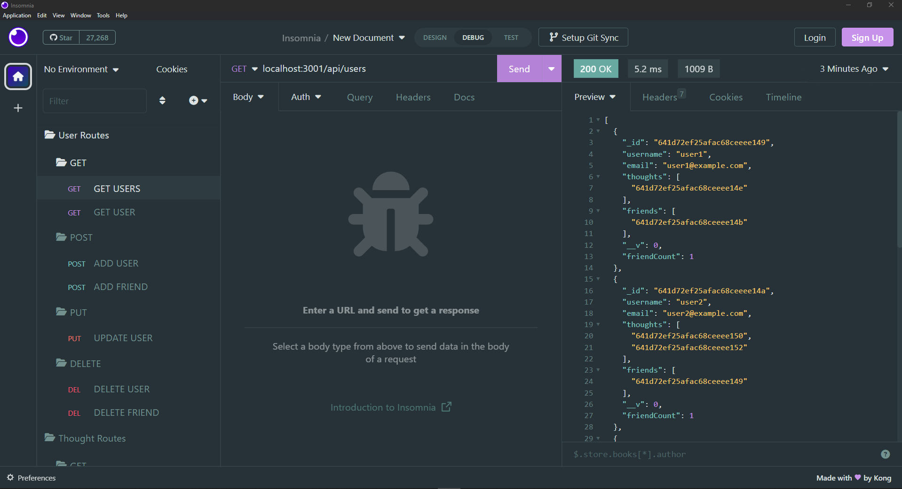

# social-network-api 

# Description

This project is a database api that utilizes mongodb via the npm package [mongoose](https://www.npmjs.com/package/mongoose).
This project uses [express](https://www.npmjs.com/package/express) as it's server [dayjs](https://www.npmjs.com/package/dayjs) for date formatting, and [nodemon](https://www.npmjs.com/package/nodemon) for running the server.

- Below are images of the api in use using insomnia.

  

  

## Table of Contents

- [Installation](#installation)
- [Usage](#usage)
- [Credits](#credits)
- [License](#license)

# Installation

Navigate to the folder and open up the integrated terminal. Run `npm i` and all the dependecies will install for you.

# Usage

After installing the dependencies, run
`npm start`
in the terminal. Open up the app in insomnia in order to view and manipulate the data.

# Contributors

I am currently the lone contributor.

# License

This project uses the MIT license.

# Tests

There are currently no tests for this application so far.

# Questions

Contact me at mohamedfarah0508@gmail.com for any questions.
